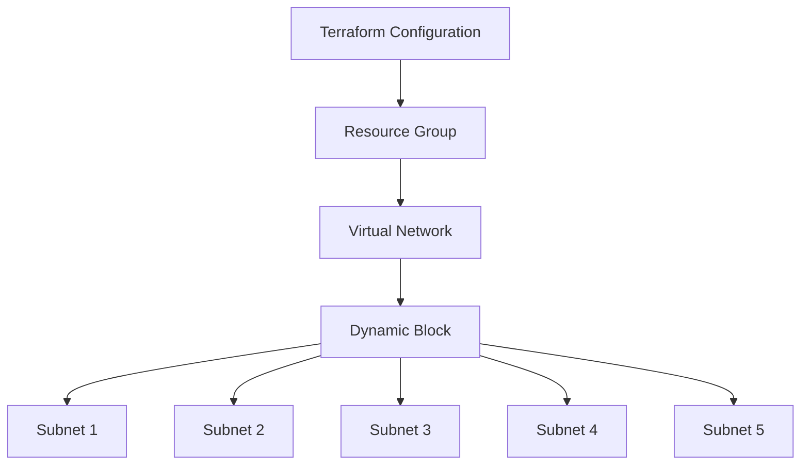

# 🌐 Azure Network Automation with Terraform Dynamic Blocks

<p align="center">
  
</p>

<p align="center">
  
  
  
  
</p>

---

## 📌 Overview

This project demonstrates how to use **Terraform Dynamic Blocks** to automate Azure networking infrastructure.

Instead of manually defining multiple subnet blocks, the solution dynamically generates subnets using a structured variable, making the infrastructure scalable, reusable, and easier to maintain.

### Resources Provisioned

* Resource Group
* Virtual Network (VNet)
* Five Subnets
* Environment-based configuration (Dev & Prod)

---

## 🏗️ Architecture



---

## ✨ Key Features

| Feature                  | Description                                       |
| ------------------------ | ------------------------------------------------- |
| 🚀 Dynamic Blocks        | Automatically generates multiple subnet resources |
| 🔄 Reusable Design       | Eliminates repetitive Terraform code              |
| 🌐 Azure Networking      | Deploys VNet and subnet architecture              |
| 🏗️ Modular Structure    | Uses reusable Terraform modules                   |
| 🌍 Multi-Environment     | Supports Dev & Production environments            |
| ⚡ Scalable Configuration | Easily increase subnet count                      |

---

## 📊 Infrastructure Overview

| Resource          | Quantity   |
| ----------------- | ---------- |
| Resource Group    | 1          |
| Virtual Network   | 1          |
| Subnets           | 5          |
| Terraform Modules | 2          |
| Environments      | Dev & Prod |

---

## 📂 Repository Structure

```text
.
├── Environment
│   ├── dev/
│   │   └── provider.tf
│   │
│   └── prod/
│       └── provider.tf
│
├── Module
│   ├── azurerm_resource_group/
│   │   └── main.tf
│   │
│   └── azurerm_virtual_network/
│       ├── main.tf
│       ├── variable.tf
│       └── terraform.tfvars
│
└── README.md
```

---

## 🛠️ Technology Stack

<p align="center">
  
</p>

---

## 🚀 Deployment

### Clone Repository

```bash
git clone <repository-url>
cd project-directory
```

### Initialize Terraform

```bash
terraform init
```

### Validate Configuration

```bash
terraform validate
```

### Preview Changes

```bash
terraform plan
```

### Apply Infrastructure

```bash
terraform apply -auto-approve
```

---

## 💡 Dynamic Block Example

```hcl
dynamic "subnet" {

  for_each = var.subnets

  content {

    name           = subnet.value.name

    address_prefix = subnet.value.address_prefix
  }
}
```

### Why Dynamic Blocks?

Without dynamic blocks, each subnet would require a separate configuration block.

Using dynamic blocks:

* Less code
* Better maintainability
* Easier scalability
* Environment flexibility

---

## 📤 Example Output

```text
rg_name   = "demo-rg"

vnet_name = "demo-vnet"

subnets = [
  "subnet-1",
  "subnet-2",
  "subnet-3",
  "subnet-4",
  "subnet-5"
]
```

---

## 🎯 Learning Outcomes

* Terraform Dynamic Blocks
* Azure Networking Fundamentals
* Infrastructure as Code (IaC)
* Reusable Terraform Modules
* Environment-Based Deployments
* Scalable Network Design

---

## 📈 Project Highlights

<p align="center">


</p>

---

## 👩‍💻 Author

**Priya Jaiswal**

Azure Cloud | DevOps | Terraform

<p align="center">
  <a href="https://github.com/Pjaisw1103">
    
  </a>

  <a href="https://linkedin.com/in/priya-jaiswal1103">
    
  </a>
</p>

---

<p align="center">
⭐ If you found this project useful, consider giving it a star.
</p>
